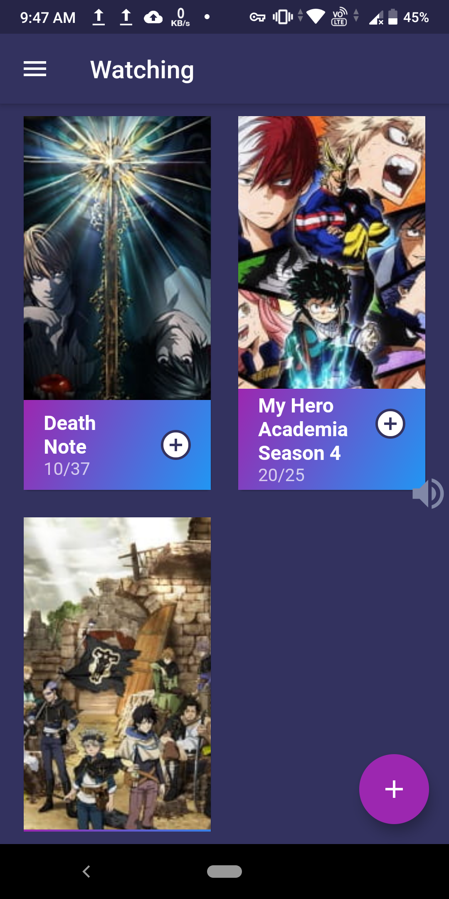
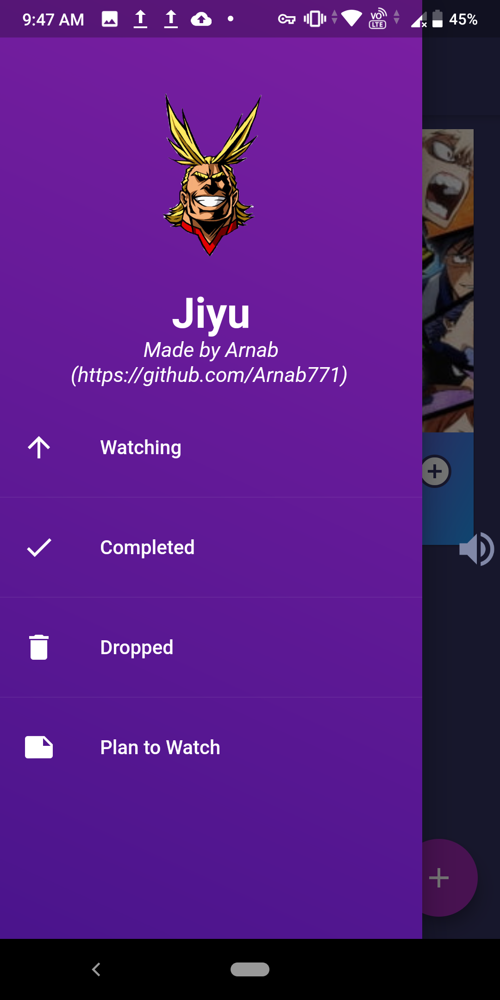

# Jiyu

A simple anime list tracker for your phone.
This app uses the Jikan API (unofficial Myanimelist API) to fetch images.

# Screenshots

# Use

## Android

You can go and download the latest builds for android from [here](https://github.com/Arnab771/Jiyu/releases/latest).

## iOS

I don't have a Mac so I would be delighted if someone could build it for iOS. The icon for the app is in assets directory. You can upload it to appicon.co to get the proper icons for iOS.
