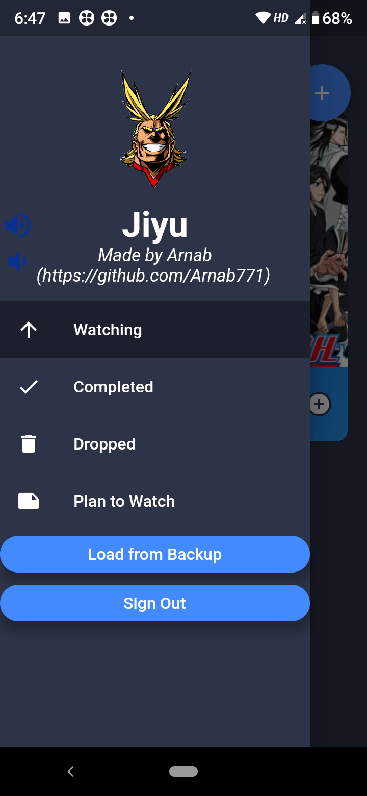
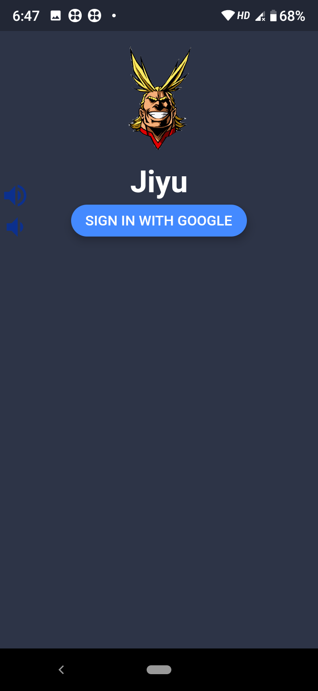

# Jiyu

A simple anime list tracker for your phone.
This app uses the Jikan API (unofficial Myanimelist API) to fetch images.

# Screenshots

# Use

## Android

You can go and download the latest builds for android from [here](https://github.com/Arnab771/Jiyu/releases/latest).
You can build it yourself. First get the **google-services.json** by registering your app to Firebase. Put it in android/app directory. Define your key.properties in android/key.properties to sign the app. Now just run `flutter build apk --target-platform android-arm,android-arm64,android-x64 --split-per-abi`

## iOS

I don't have a Mac so I would be delighted if someone could build it for iOS. The icon for the app is in assets directory. You can upload it to appicon.co to get the proper icons for iOS. If you want to build it, register your app in Firebase and **GoogleService-Info.plist**. Put it in ios/Runner directory. Run `flutter build ios --release` to build for ios.
